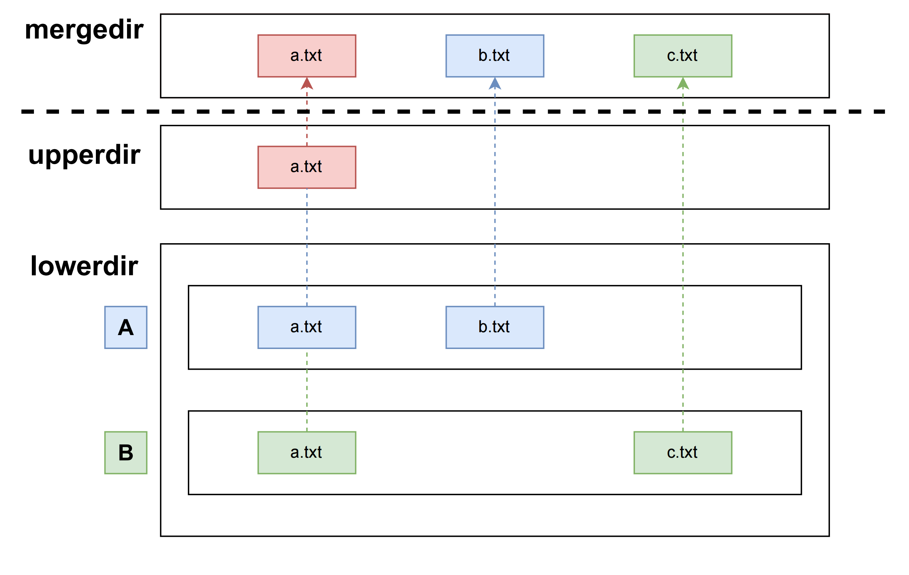

# UnionFS

## 1. 什么是 UnionFS

UnionFS 的全称是 `Union File System` ，是一种把其他文件系统联合到一个联合挂载点的文件系统服务。

简单来说就是：**把多个目录合并成一个目录**。

比如这样：

```
.                                                .
├── A                                            └── C
│   ├── a   mount -t overlay A:B C（AB合并为C）       ├── a
│   └── x    ───────────────────────────────>        ├── b
└── B                                                └── x
    ├── b
    └── x
```

可以看到，在这个合并后的目录 C 里，有 a、b、x 三个文件，并且 x 文件只有一份。这，就是“**联合**”的含义。

那么 UnionFS 能够为容器带来什么样的好处呢？

我们知道，每个容器拥有独自的文件系统，而不同的文件系统之间也许有内容相同的文件，例如：

> 容器 A：在 Ubuntu:22.04 镜像的基础上，仅添加了 `/tomcat` 目录，里面有 tomcat 服务相关的软件；
> 
> 容器 B：在 Ubuntu:22.04 镜像的基础上，仅添加了 `/mysql` 目录，里面有 mysql 服务相关的软件。

这两个容器除了 `/tomcat` 和 `/mysql` 中的内容不同，其余的文件系统完全相同，当我们拉取镜像的时候，如果把基础的 Ubuntu:22.04 文件系统拉取两次，不就是纯纯的资源浪费了吗？我们完全可以只拉取一次 Ubuntu:22.04 镜像，然后再拉取这两个容器各自的 `/tomcat` 和 `/mysql`，将它与 Ubuntu 镜像**合并**，这样就可以节省很多资源。

这里的**合并**操作，正是 UnionFS 的职责所在。

## 2. UnionFS 在 Linux 上的实现 —— overlay

overlay 于 2014 年正式合入 Linux-3.18 主线内核，目前其功能已经基本稳定且被逐渐推广，特别在容器技术中更是势头难挡。实验室 Crater 集群的容器运行时 containerd，就是使用 overlay 作为默认的存储驱动。

overlay 简单来讲可以概括为三点：
- 上下层同名目录合并；
- 上下层同名文件覆盖；
- lower dir 内文件写时拷贝（**Copy-on-Write，CoW**）

目前不理解没关系，我们来实操一下。

## 3. overlay 实操

接下来实操的目录结构，可以参考 [/basics/UnionFS/src](./src/) 目录。

### 3.1. 环境准备

创建一个具有如下结构和内容的目录：

```bash
.
├── A
│   ├── a.txt     # I am in A
│   └── b.txt     # I am in A
├── B
│   ├── a.txt     # I am in B
│   └── c.txt
└── merged
```

我们把 `A` 和 `B` 联合挂载到 `merged` 中。根据 overlay 技术的要求，我们还需要创建两个新目录：`upper` 和 `worker`，分别充当 overlay 的顶层目录和工作目录。

```bash
# 创建 upper 和 worker 目录
jzd@master-58:$ mkdir upper && mkdir worker
```

### 3.2. 开始实操

我们使用 mount 进行 overlay 联合挂载：

```bash
# 使用 overlay 
jzd@master-58:$ sudo mount -t overlay myoverlay -o\    # 挂载的文件系统名为 myoverlay ，类型为 overlay
                                      lowerdir=A:B,\   # 挂载的底层目录从上到下为 A、B，只读 
                                    upperdir=upper,\   # 挂载的顶层目录为 upper，可读写
                                    workdir=worker \   # 工作目录为 worker，overlay 实现需要，目前可以无视（暂时）
                                            merged     # 挂载点的位置
```

之后，我们看看现在目录是什么样子：
```bash
.
├── A
│   ├── a.txt     # I am in A
│   └── b.txt     # I am in A
├── B 
│   ├── a.txt     # I am in B
│   └── c.txt     # I am in B
├── merged 
│   ├── a.txt     # I am in A
│   ├── b.txt     # I am in A
│   └── c.txt     # I am in B
├── upper
└── worker
    └── work
```

发现了吗？`merged` 目录下有了 `A` 和 `B` 的所有文件，而且同名文件会被覆盖。在我们的 `mount` 命令中，设置了 `lowerdir=A:B`，所以 `A` 是更上层的目录，它会覆盖 `B` 目录的同名文件。

那挂载之后，我们对 `merged` 目录的操作会对 `A` 和 `B` 有什么影响呢？

尝试一下呗，改增删都试试。

#### 3.2.1. 改操作

我们将 `merged` 目录下的 `a.txt` 文件内容改为 `I am in merged`：

```bash
echo "I am in merged" > merged/a.txt
```

结果：
```bash
.
├── A
│   ├── a.txt     # I am in A
│   └── b.txt     # I am in A
├── B
│   ├── a.txt     # I am in B
│   └── c.txt     # I am in B
├── merged
│   ├── a.txt     # I am in merged
│   ├── b.txt     # I am in A
│   └── c.txt     # I am in B
├── upper
│   └── a.txt     # I am in merged
└── worker
    └── work 
```

巧妙，`A`、`B` 目录的内容都没有变，但是 `merged` 目录的 `a.txt` 文件内容变了，而且 `upper` 目录下多了个 `a.txt` 文件。

这就是大名鼎鼎的**写时拷贝**机制（Copy-on-Write，CoW），只有进行写操作时才会拷贝文件。

我们再尝试修改 `A` 目录下的 `a.txt` 文件内容：

```bash
echo "I am in A, but afterwards." > A/a.txt
```

结果：
```bash
.
├── A
│   ├── a.txt     # I am in A, but afterwards.
│   └── b.txt     # I am in A
├── B
│   ├── a.txt     # I am in B
│   └── c.txt     # I am in B
├── merged
│   ├── a.txt     # I am in merged
│   ├── b.txt     # I am in A
│   └── c.txt     # I am in B
├── upper
│   └── a.txt     # I am in merged
└── worker
    └── work 
```

厉害了，`A` 目录下的改动根本不会影响到 `merged` 目录。

我们最后尝试直接修改 `upper` 目录下的 `a.txt` 文件内容：

```bash
echo "I am in upper" > upper/a.txt
```

结果：
```bash
.
├── A
│   ├── a.txt     # I am in A, but afterwards.
│   └── b.txt     # I am in A
├── B
│   ├── a.txt     # I am in B
│   └── c.txt     # I am in B
├── merged
│   ├── a.txt     # I am in upper
│   ├── b.txt     # I am in A
│   └── c.txt     # I am in B
├── upper
│   └── a.txt     # I am in upper
└── worker
    └── work 
```

看来对 `upper` 目录的操作会直接影响到 `merged` 目录。

至此我们可以大致猜测出 overlay 的 `lowerdir`、`upperdir`、`mergedir` 之间的关系了：



我们在直观上看到的、操作的 `merged` 目录，实际上的数据来源和操作落地都发生在 `lowerdir` 和 `upperdir` 中，而 `lowerdir` 只在最开始时影响 `merged` 的初始化，之后便不会起任何作用。之后对 `merged` 的所有操作（例如修改了文件），会直接发生在到 `upperdir` 上。

我们继续进行其它操作来验证一下。

#### 3.2.2. 增操作

我们在 `merged` 目录下增加一个文件 `d.txt`：

```bash
touch merged/d.txt
```

结果：
```bash
.
├── A
│   ├── a.txt     # I am in A, but afterwards.
│   └── b.txt     # I am in A
├── B
│   ├── a.txt     # I am in B
│   └── c.txt     # I am in B
├── merged
│   ├── a.txt     # I am in upper
│   ├── b.txt     # I am in A
│   ├── c.txt     # I am in B
│   └── d.txt
├── upper
│   ├── a.txt     # I am in upper
│   └── d.txt
└── worker
    └── work 
```

合理，`upper` 目录就像我们猜测的那样多了个 `d.txt` 文件。

#### 3.2.3. 删操作

我们删除 `merged` 目录下的 `b.txt` 文件：

```bash
rm merged/b.txt
```

结果：
```bash
.
├── A
│   ├── a.txt     # I am in A, but afterwards.
│   └── b.txt     # I am in A
├── B
│   ├── a.txt     # I am in B
│   └── c.txt     # I am in B
├── merged
│   ├── a.txt     # I am in upper
│   ├── c.txt     # I am in B
│   └── d.txt
├── upper
│   ├── a.txt     # I am in upper
│   ├── b.txt
│   └── d.txt
└── worker
    └── work 
        └── #4fa
```


哦？`upper`目录下反而多了个 `b.txt`文件，而且一直默默无闻的 `worker` 目录下也多了个很像 sha256 校验码的文件。

我们仔细查看一下 `upper/b.txt` 这个文件的属性：

```bash
$ ls -l upper/b.txt
c--------- 2 root root 0, 0 Jun 23 08:18 upper/b.txt
```

查阅相关资料后得知，在 overlay 文件系统中，由于之前提到的**写时拷贝**机制（CoW）的存在，删除文件的操作也需要体现为创建文件，overlay 选择的是创建`c---------`这样的字符设备作为**whiteout** 文件，用来告诉自己 `lowerdir` 目录中的所有同名文件已经被删了，可以忽略它们。

简单来讲它就是一个记号，表明 `lowerdir` 中同名的这个文件被删除了。

而 `worker` 目录中很像 sha256 校验码的文件，同样也是一个字符设备，只不过它存储的是与删除操作相关的临时数据和元数据，具体含义这里不就深究了。

至此，我们对 overlay 目录结构的猜测，基本验证完成了。

## 4. 总结

通过上面的实践，相信大家对 overlay 这样的 UnionFS 有了更直观的认识，我们可以让不同目录的内容合并到一个联合挂载点，并对该挂载点进行像正常情况一样的目录操作，只是相应的操作会映射到 overlay 文件系统的 upper 目录中。
