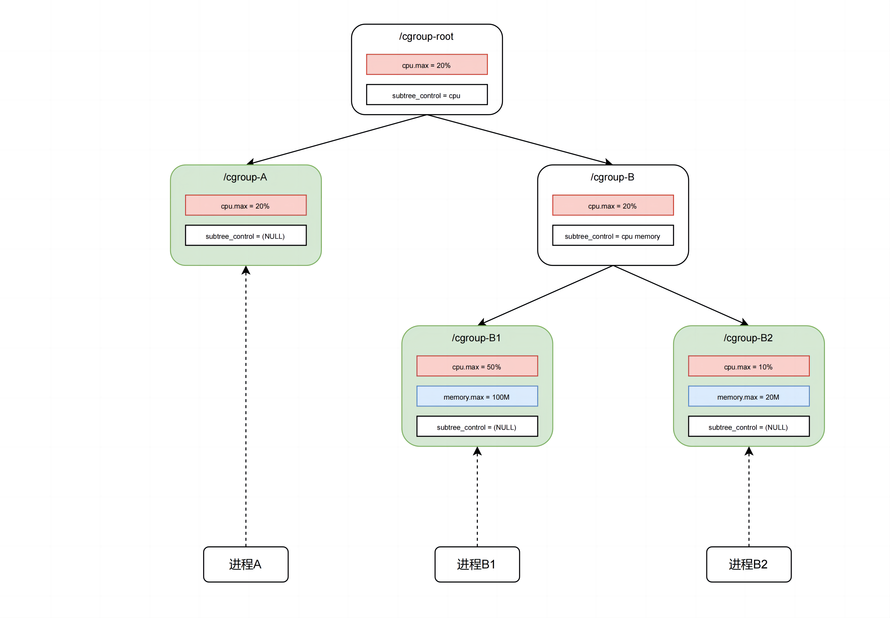

# cgroup

cgroups 是容器三技术中比较简单和直接的一个。

## 1. 什么是 cgroup

cgroup 的全称是 `Control Group`（控制组），顾名思义，是对进程进行“控制”的一种机制，它限制进程的资源使用。

看个例子：

> 某个进程很没素质，运行着一个死循环，它将某个 CPU 核心的使用率跑到了 90+%，别的进程都很憋屈。

这个时候，我们就可以使用 cgroup 来限制这个可恶进程的 CPU 使用率，让它的 CPU 使用率在 20% 左右。

cgroup 有两个版本，分别是 v1 和 v2（目前的主流），本文主要讲解 cgroup v2。

### 1.1. cgroup v2 基本概念

*（最详细的介绍：[Linux 官方文档](https://www.kernel.org/doc/html/latest/admin-guide/cgroup-v2.html)）*

整个 cgroup v2 是一个树形结构，被称为 `v2 hierarchy`，树的每个节点被称为一个 `cgroup`，是一组对资源的约束，它通过若干个 `controller`（网上一些帖子称它为 subsystem，它们是同一个东西）来控制资源的使用，每个 `controller` 会对某一种资源进行控制（例如 CPU 占用、内存占用等）。

某个进程只能属于树中的某一个节点（不能同时属于两个节点），且该节点只能是**叶子节点**。



## 2. cgroup 实操

Linux 以文件系统的形式将 cgroup 树暴露给用户，树的根节点挂载在 `/sys/fs/cgroup` 下，我们可以通过 `mount` 命令来查看：

```bash
$ mount -t cgroup2
cgroup2 on /sys/fs/cgroup type cgroup2 (rw,nosuid,nodev,noexec,relatime,nsdelegate,memory_recursiveprot)
```

### 2.1. 创建 cgroup 节点
我们希望创建子节点，只需要在 `/sys/fs/cgroup` 下创建一个目录即可：

```bash
$ sudo mkdir /sys/fs/cgroup/mygroup
```

之后我们打开这个目录，能够看到系统自动地为这个节点创建了 cgroup 的相关文件：

```bash
$ sudo ls /sys/fs/cgroup/mygroup
cgroup.controllers      cgroup.type            cpu.stat                  hugetlb.1GB.rsvd.max      io.stat              memory.oom.group     pids.events ...
```

其中，以 `cgroup.` 开头的文件是当前 cgroup 的总体信息；以 `cpu.` 开头的文件是 CPU 的 `controller`；以 `memory.` 开头的文件是内存的 `controller`，以此类推。每个文件具体的含义可以参考 [Linux官方文档 - Controllers](https://www.kernel.org/doc/html/latest/admin-guide/cgroup-v2.html#controllers).

那么这个 cgroup 总共有哪些 `controller` 呢？我们可以查看 `cgroup.controllers` 文件：

```bash
$ cat /sys/fs/cgroup/mygroup/cgroup.controllers
cpuset cpu io memory hugetlb pids rdma misc
```

这个文件的内容来自于父节点的 `cgroup.subtree_control` 文件，它们的内容一定是一样的。也就是说，当前节点的 `controller` 是由父节点决定的。

如果想删除这个节点，直接删除这个目录就可以了，但要注意，要使用 `rmdir` 命令，而不是 `rm -rf`：

```bash
$ sudo rmdir /sys/fs/cgroup/mygroup
```

我们暂时先不删除 `mygroup`，接下来会用到它。（如果删了，重新创建一个就可以啦）

### 2.2. 通过 cgroup 控制进程 CPU 使用率

我们在 `mygroup` 下创建一个子节点，名叫 `inf`，我们会用这个 cgroup 来控制接下来的进程：

```bash
sudo mkdir /sys/fs/cgroup/mygroup/inf
```

`inf` 节点会根据父节点的 `cgroup.subtree_control` 来决定它的 `controller`，当前应该是空的：

```bash
$ sudo cat /sys/fs/cgroup/mygroup/inf/cgroup.controllers
(空的)
```

我们修改父节点 `mygroup` 的 `cgroup.subtree_control`，让 `inf` 节点拥有 `cpu` 的 `controller`：

```bash
$ echo "+cpu" | sudo tee /sys/fs/cgroup/mygroup/cgroup.subtree_control
```

不出意外，现在 `inf` 会是这样：

```bash
$ sudo ls /sys/fs/cgroup/mygroup/inf
... cpu.idle   cpu.max  cpue.max.burst ...

$ sudo cat /sys/fs/cgroup/mygroup/inf/cgroup.controllers
cpu
```

很好，现在我们创建一个没素质的流氓进程，它运行一个死循环：

```bash
$ while : ; do : ; done &
[1] 2637941
```

这个流氓进程的 PID 是 `2637941`，我们如何把它放到 `inf` 节点呢？

很简单，只需要把 pid 写入 `inf` 节点的 `cgroup.procs` 文件就可以了：

```bash
echo 2637941 | sudo tee /sys/fs/cgroup/mygroup/inf/cgroup.procs
```

我们用 `top` 命令来查看一下流氓进程的 CPU 使用率：

```bash
$ top -p 2637941
    PID USER      PR  NI    VIRT    RES    SHR  S   %CPU   %MEM     TIME+  COMMAND
2637941 root      20   0    7768    704      0  R  100.0    0.0   2:03.99  bash 
```

咦，CPU 占用率怎么还是 100%？cgroup 没起作用吗？

哦...我们还没有设置 `inf` 节点的 CPU 限制呢。

我们将以下内容写入 `inf` 节点的 `cpu.max`，将 CPU 占用率限制为 20%：

```bash
echo 20000 100000 | sudo tee /sys/fs/cgroup/mygroup/inf/cpu.max
```

这里解释一下，`cpu.max` 文件的内容是两个数字，分别是 `cfs_quota` 和 `cfs_period`，单位是微秒。前缀 `cfs` 是 Linux 内核调度器 `Compeletely Fair Scheduler` 的缩写，这两个值是进程交给 `cfs` 的配置信息。`cfs_quota` 表示在期望调度周期内最多可以使用的 CPU 时间，`cfs_period` 表示期望调度周期。

之后重新看看流氓进程的 CPU 使用率：

```bash
$ top -p 2637941
    PID USER      PR  NI    VIRT    RES    SHR  S   %CPU   %MEM     TIME+  COMMAND
2637941 root      20   0    7768    704      0  R   19.9    0.0   6:41.00  bash
```

太对了，CPU 占用率降到了 20%。

那么对于 CPU 使用率的限制，我们就实践成功了。对于其它资源的限制也是类似的，只需要修改相应的 `controller` 的文件即可。

## 3. 总结

cgroup 呈树形结构，并通过 `controller` 来对进程进行资源控制，我们可以通过它暴露的文件系统来操作 cgroup。

通过上面的实践，相信大家一定能直观的感受到 cgroup 的作用，以及它的简单易用。