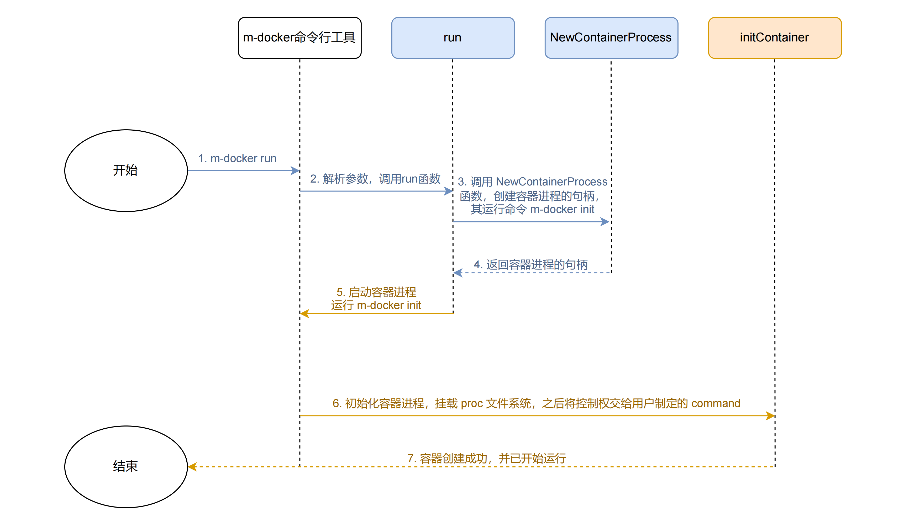

# chapter1 - run命令实现

本文主要实现我们的第一个命令 `m-docker run -it [command]`，其作用类似于 `docker run -it [command]`.

完整内容在 tag `feat-run`.

## 具体实现

### main.go

首先是 `main.go` 文件，它是整个命令行工具的入口文件。

使用 urfave/cli 提供的框架来实现我们的命令行工具 `m-docker`，并添加了两个子命令 `RunCommand` 和 `InitCommand`，然后在 app,Before 内初始化日志工具 `logrus` 的配置。

```go
package main

import (
	"os"

	"github.com/urfave/cli"

	log "github.com/sirupsen/logrus"

	"m-docker/cmd"
)

const (
	usage = `a simple container runtime implementation.

The purpose of this project is to learn how docker(exactly, runC) works and how to write a docker by ourselves.
Enjoy it, just for fun.`
)

// main 函数是整个程序的入口
// 使用的是 github.com/urfave/cli 框架来构建命令行工具
func main() {
	app := cli.NewApp()
	app.Name = "m-docker"
	app.Usage = usage

	// 添加 run 等子命令
	app.Commands = []cli.Command{
		cmd.RunCommand,
		cmd.InitCommand,
	}
	app.Before = func(context *cli.Context) error {
		// 设置日志格式为 json
		log.SetFormatter(&log.JSONFormatter{})

		log.SetOutput(os.Stdout)
		return nil
	}

	if err := app.Run(os.Args); err != nil {
		log.Fatal(err)
	}
}
```

### cmd/run.go

我们在 `run.go` 里定义了 `RunCommand` 子命令，它用来响应 `m-docker run`。它会解析命令行参数，并调用 `run` 函数。

```go
// m-docker run 命令
var RunCommand = cli.Command{
	Name:      "run",
	Usage:     `create and run a container`,
	UsageText: `m-docker run -it [command]`,
	Flags: []cli.Flag{
		cli.BoolFlag{
			Name:  "it", // 简单起见，这里把 -i 和 -t 合并了
			Usage: "enable tty",
		},
	},

	// m-docker run 命令的入口点
	// 1. 判断参数是否含有 command
	// 2. 获取 command
	// 3. 调用 run 函数去创建和运行容器
	Action: func(context *cli.Context) error {
		if context.NArg() < 1 {
			return fmt.Errorf("missing container command")
		}
		cmd := context.Args().Get(0)
		tty := context.Bool("it")
		run(tty, cmd)
		return nil
	},
}
```

接下来我们看看 `run` 函数做了些什么：

```go
func run(tty bool, command string) {
	// 生成一个容器进程的句柄，它启动后会运行 m-docker init [command]
	process := libcontainer.NewContainerProcess(tty, command)

	// 启动容器进程
	if err := process.Start(); err != nil {
		log.Error(err)
	}
	_ = process.Wait()
	os.Exit(-1)
}
```
它会调用 `libcontainer` 包里的 `NewContainerProcess` 函数来创建一个容器进程的句柄，一个 `os/exec.Cmd` 对象，执行完后便退出。

### libcontainer/container-process.go

```go
// 生成一个容器进程的句柄
// 该容器进程将运行 m-docker init [command]，并拥有新的 UTS、PID、Mount、NET、IPC namespace
func NewContainerProcess(tty bool, command string) *exec.Cmd {
	// 该进程会调用符号链接 /proc/self/exe，也就是 m-docker 这个可执行文件，并传递参数 init 和 [command]，即运行 m-docker init [command]
	args := []string{"init", command}
	cmd := exec.Command("/proc/self/exe", args...)

	// CLoneflags 参数表明这个句柄将以 clone 系统调用创建进程，并设置了新的 UTS、PID、Mount、NET 和 IPC namespace
	cmd.SysProcAttr = &syscall.SysProcAttr{
		Cloneflags: syscall.CLONE_NEWUTS | syscall.CLONE_NEWPID | syscall.CLONE_NEWNS |
			syscall.CLONE_NEWNET | syscall.CLONE_NEWIPC,
	}

	// 如果用户指定了 -it 参数，就需要把容器进程的输入输出导入到标准输入输出上
	if tty {
		cmd.Stdin = os.Stdin
		cmd.Stdout = os.Stdout
		cmd.Stderr = os.Stderr
	}

	return cmd
}
```

可以看到，`NewContainerProcess` 函数会构建一个命令为 `/proc/self/exe` 的 `os/exec.Cmd` 对象，这个表示调用 `当前可执行文件`，即 `m-docker` 这个可执行文件。第一个参数为 `init`，也就是说这个对象最后会执行 `m-docker init` 这个命令。

这也就是为什么我们除了要实现一个 `m-docker run` 命令之外，还要实现一个 `m-docker init` 命令。

当 `run.go` 里执行 `process.Start()` 后，便会调用 `m-docker init` 命令，这时会创建一个新进程，这个就是我们的容器进程，容器进程会先运行 `m-docker init` 命令的内容。

### cmd/init.go

来看看 `m-docker init` 命令的实现：

```go
// m-docker init 命令（它不可以被显式调用）
var InitCommand = cli.Command{
	Name:   "init",
	Usage:  `Init the container process, do not call it outside!`,
	Hidden: true, // 隐藏该命令，避免被显式调用

	// 1. 获取传递来的 command 参数
	// 2. 在容器中进行初始化
	Action: func(context *cli.Context) error {
		log.Infof("Inside the container!")
		command := context.Args().Get(0)
		log.Infof("command: %s", command)
		err := initContainer(command)
		return err
	},
}
```

`m-docker init` 命令会解析 `command` 参数，并调用 `initContainer` 函数来初始化容器：

```go
func initContainer(command string) error {
	log.Infof("Start func: initContainer")

	// 实现 mount --make-rprivate /proc
	// 使得容器内的 /proc 目录与宿主机的 /proc 目录隔离开来
	flags := uintptr(syscall.MS_PRIVATE | syscall.MS_REC)
	_ = syscall.Mount("none", "/proc", "none", flags, "")

	// 挂载容器自己的 proc 文件系统
	defaultMountFlags := syscall.MS_NOEXEC | syscall.MS_NOSUID | syscall.MS_NODEV
	_ = syscall.Mount("proc", "/proc", "proc", uintptr(defaultMountFlags), "")

	// syscall.Exec 会调用 execve 系统调用，它会用新的程序段替换当前进程的程序段
	// 成功执行这个系统调用后，当前 initContainer 函数剩余的程序段将不会继续运行，而是被用户定义的 command 替换
	// 如果失败了才会返回错误，继续执行剩下的程序段
	argv := []string{command}
	if err := syscall.Exec(command, argv, os.Environ()); err != nil {
		log.Errorf(err.Error())
	}

	return nil
}
```

这里首先会将 `/proc` 目录与宿主机的 `/proc` 目录隔离开来，然后挂载容器自己的 `/proc` 文件系统。

本函数最后的 `syscall.Exec` 是最为重要的一步，正是它完成将当前的 `initContainer` 函数替换为用户定义的 `command`。

首先，创建起来一个容器之后，容器内的第一个进程，也就是 PID 为 1 的那个进程，运行的是 `m-docker init` 的 Action，而不是用户所指定的 `command`。这和我们的预想是有差异的，我们希望用户指定的 `command` 也能够在 PID 为 1 的进程中运行。

**有没有什么办法能把用户的 `command` 也运行在 PID 为 1 的进程中呢？**

`syscall.Exec` 背后的 `execv` 系统调用就是做这件事的。

```c
int execve(const char *filename, char *const argv[], char *const envp[]);
```

这个系统调用，它的作用是：立即在当前进程的上下文中执行 `filename` 路径的程序。它会用 `filename` 路径处的程序替换当前进程的代码段和数据段，清空堆段、栈段，并继承当前进程的 pid 和打开的文件描述符。

也就是说，调用这个系统调用，会将当前进程完全变身为另一个程序，同时保持原进程的 pid 和部分其它属性。这样，用户指定的 `command` 就会在 PID 为 1 的进程中运行了。

> 这其实也是目前主流的低层级容器运行时 runC 的实现方式。

## 总结

run 命令具体的执行流程图如下：



其中蓝色的部分在 `m-docker run` 所在的进程内执行，棕色的部分在容器进程内执行。