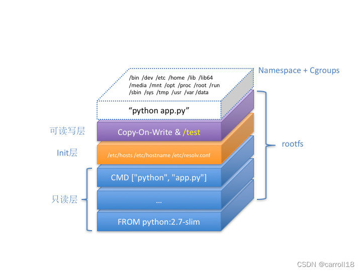

# chapter5 - 基于 overlay 联合挂载根文件系统

上一节中我们使用 `pivot_root` 系统调用切换了容器的根文件系统，但如果我们希望后续引入**镜像**的概念，那么按照 OCI 镜像规范，镜像层需要是只读的，而宿主机的 `/root/rootfs` 目录可以被直接影响，这显然是不对的。

因此这一节我们将基于 `overlay` 文件系统，将只读的镜像层与可读写层联合挂载为根文件系统，以此来解决这个问题。

## 1. 什么是 overlay？

基本概念的讲解与实操见 [UnionFS](../basics/UnionFS/readme.md).

## 2. 实现思路

Docker 在使用镜像来运行容器的时候，会新建 2 个 layer：`rw layer` 和 `init layer`，也就是说，一个容器的 rootfs 一共有至少 3 层：

- `rw 层`：1层，可读写，容器运行后对 rootfs 的修改保存在这个层。
- `init 层`：1层，只读，容器启动时新建的层，保存 hostname 等配置信息。
- `image 层`：n 层，只读，镜像里的各层。

这里借用网上的一张图：



Docker 在准备好这些层之后，会使用 `overlay` 将这些层联合挂载，合并后的目录作为容器的 rootfs。

这里我们借鉴 Docker 的思路，将除 `init 层` 之外的只读的镜像层与可读写的 rw 层准备好，并将其联合挂载为容器的 rootfs，具体流程如下：

- 创建 `/var/lib/m-docker` 目录，作为容器数据的根目录
- 在 `/var/lib/m-docker` 下创建 `images`、`layers`、`rootfs` 三个目录
  - `images`：存放各镜像的 tar 压缩包
  - `layers`：存放各容器的所有layer，包括镜像解压后的 image 只读层，以及容器运行后的 rw 可读写层
  - `rootfs`：存放联合挂载后的各容器的 rootfs
- 将镜像解压到 `layers` 目录下，得到只读的 image 层
- 在 `layers` 目录下创建 rw 层，作为容器运行后的可读写层
- 在 `rootfs` 目录下创建 mountPoint 目录，作为联合挂载的挂载点
- 使用 `overlay` 将 image 层和 rw 层联合挂载到 mountPoint 目录下
- 将容器的 rootfs 设置为 mountPoint 目录

## 3. 具体实现

`/var/lib/m-docker` 目录以及 `images`、`layers`、`rootfs` 这三个目录我们手动创建好。

目前容器默认运行 `ubuntu` 镜像，我们将 `ubuntu.tar` 压缩包放入 `/var/lib/m-docker/images` 目录下。

> 获得 `ubuntu.tar` 压缩包的办法查看 [chapter4](./chapter4-使用pivot_root切换根文件系统.md#1-准备根文件系统)

准备好后的目录结构如下：

```bash
/var/lib/m-docker
├── images
│   └── ubuntu.tar
├── layers
└── rootfs
```

之后我们便可以开始实现具体的联合挂载逻辑。

### libcontainer/rootfs.go

我们封装一个可以被外部调用的 `CreateRootfs` 函数，用于创建容器的 rootfs 目录。

```go
// m-docker 数据的根目录
var rootPath = "/var/lib/m-docker"

// 创建容器的 rootfs 目录
func CreateRootfs() error {
	imagePath := path.Join(rootPath, "images", "ubuntu.tar")
	imageLayerPath := path.Join(rootPath, "layers", "ubuntu")
	rwLayerPath := path.Join(rootPath, "layers", "default")
	rootfsPath := path.Join(rootPath, "rootfs", "default")

	// 首先解压镜像
	if err := unzipImageLayer(imagePath, imageLayerPath); err != nil {
		return fmt.Errorf("fail to unzip image layer: %v", err)
	}

	// 之后准备 overlay 所需要的目录
	if err := prepareOverlayDir(rwLayerPath, rootfsPath); err != nil {
		return fmt.Errorf("fail to prepare overlay dir:  %v", err)
	}

	// 最后使用 overlay 将镜像层读写层叠加到 rootfs 上
	if err := mountRootfs([]string{imageLayerPath}, rwLayerPath, rootfsPath); err != nil {
		_ = os.RemoveAll(rwLayerPath)
		return fmt.Errorf("fail to mount rootfs: %v", err)
	}

	return nil
}
```

其中：
- `imagePath`：镜像压缩包路径
- `imageLayerPath`：解压后的 image 层路径（目前假设镜像压缩包内只有1个 image 层）
- `rwLayerPath`：rw 层路径
- `rootfsPath`：联合挂载的 rootfs 路径。

接下来是各个函数的具体实现：

```go
// 将镜像解压到指定目录下
func unzipImageLayer(imagePath string, dest string) error {
	exist, err := pathExists(dest)
	if err != nil {
		return fmt.Errorf("unable to judge whether dir %s exists. %v", dest, err)
	}

	// 镜像不存在
	if !exist {
		// 新建目录
		if err = os.Mkdir(dest, 0755); err != nil {
			return fmt.Errorf("fail to create dir %s:  %v", dest, err)
		}
		// tar -xvf 命令解压镜像
		if err = exec.Command("tar", "-xvf", imagePath, "-C", dest).Run(); err != nil {
			return fmt.Errorf("fail to unzip image %v: %v", imagePath, err)
		}
	}
	// 若镜像已经存在，则无需解压，直接返回
	return nil
}

// 判断路径目标是否存在
func pathExists(path string) (bool, error) {
	_, err := os.Stat(path)
	if err == nil {
		return true, nil
	}
	if os.IsNotExist(err) {
		return false, nil
	}
	return false, err
}
```

`unzipImageLayer` 函数较为简单，值得注意的是，若镜像已经解压过，则无需再次解压。

```go
// 创建 overlay 所需要的目录
func prepareOverlayDir(rwLayerPath string, rootfsPath string) error {
	// 要创建的目录有 4 个
	// rwLayerPath，upper 和 work 的父目录
	// rwLayerPath/fs，作为 upper 目录
	// rwLayerPath/work，作为 work 目录
	// rootfsPath, 联合挂载点
	dirs := []string{
		rwLayerPath,
		path.Join(rwLayerPath, "fs"),
		path.Join(rwLayerPath, "work"),
		rootfsPath,
	}

	for _, dir := range dirs {
		if err := os.Mkdir(dir, 0755); err != nil {
			_ = os.RemoveAll(rwLayerPath)
			return fmt.Errorf("fail to create dir %s: %v", dir, err)
		}
	}

	return nil
}
```

`prepareOverlayDir` 函数用于创建 overlay 所需要的目录，包括 rw 层、upper 和 work 目录，以及联合挂载点目录。

```go
// 使用 overlay 进行联合挂载
func mountRootfs(lowerDir []string, rwLayerDir string, rootfs string) error {
	// 拼接参数
	overlayArgs := fmt.Sprintf("lowerdir=%s,upperdir=%s,workdir=%s",
		strings.Join(lowerDir, ":"),
		path.Join(rwLayerDir, "fs"),
		path.Join(rwLayerDir, "work"))

	// 完整命令：mount -t overlay m-docker-overlay lowerdir=xxx,upperdir=xxx,workdir=xxx xxx
	cmd := exec.Command("mount", "-t", "overlay", "m-docker-overlay", "-o", overlayArgs, rootfs)
	log.Infof("Mount overlay command: %v", cmd.String())
	if err := cmd.Run(); err != nil {
		return fmt.Errorf("fail to overlay mount: %v", err)
	}

	return nil
}
```

`mounRootfs` 函数用于将 image 层和 rw 层联合挂载到 rootfs 目录下，本质上就是调用命令行的 `mount` 命令。

容器结束运行后，我们还需要清理掉 rw 层和联合挂载点目录，以及卸载联合挂载，因此还需要定义一个 `DeleteRootfs` 函数供外部调用。

```go
// 当容器退出后，删除 rootfs 相关的目录
func DeleteRootfs() {
	rwLayerPath := path.Join(rootPath, "layers", "default")
	rootfsPath := path.Join(rootPath, "rootfs", "default")

	umountRootfs(rootfsPath)
	deleteOverlayDir(rwLayerPath, rootfsPath)
}
```

其中 `umountRootfs` 函数用于解除联合挂载，`deleteOverlayDir` 函数用于删除 rw 层和联合挂载点目录。

```go
// 解除 overlay 挂载
func umountRootfs(mountPoint string) {
	_ = exec.Command("umount", mountPoint).Run()
}

// 删除 overlay 所准备的目录
func deleteOverlayDir(rwLayerPath string, rootfsPath string) {
	_ = os.RemoveAll(rootfsPath)
	_ = os.RemoveAll(rwLayerPath)
}
```

之后只需要在容器启动前调用 `CreateRootfs` 函数，在容器结束运行后调用 `DeleteRootfs` 函数即可。

### cmd/run.go

```go
func run(tty bool, comArray []string, resConf *resource.ResourceConfig) {
	// 构建 rootfs
	if err := libcontainer.CreateRootfs(); err != nil {
		log.Errorf("Create rootfs error: %v", err)
		return
	}

	// 省略...

	cgroupManager, err := cgroup.NewCgroupManager("m-docker.slice")
	// 当前进程结束后，释放资源
	defer func() {
		// 删除 rootfs
		libcontainer.DeleteRootfs()

		// 当前函数 return 后释放 cgroup
		cgroupManager.Destroy()
	}()
	if err != nil {
		log.Errorf("Create new cgroup manager fail: %v", err)
		return
	}
	
	// 省略...
}
```

我们在 `run` 函数（此时在容器进程的父进程中）的一开始就调用 `CreateRootfs` 函数来创建容器的 rootfs 目录，并设置在容器结束运行后调用 `DeleteRootfs` 函数来清理掉相关目录。

之后我们修改容器进程句柄的 cwd 为联合挂载后的 rootfs 目录。

### libcontainer/container-process.go

```go
func NewContainerProcess(tty bool) (*exec.Cmd, *os.File) {
	// 省略...

	// 设置容器进程的工作目录为 UnionFS 联合挂载后所得到的 rootfs 目录
	cmd.Dir = "/var/lib/m-docker/rootfs/default"

	return cmd, writePipe
}
```

还有一点值得注意，我们上一节在使用 `pivot_root` 切换 rootfs 时，首先做了一步 bind mount，这是因为 `pivot_root` 需要 `new_root` 和 `put_old` 都是挂载点，我们担心 `new_root` 不是挂载点，所以通过 bind mount 将其转化为挂载点。

而通过 `overlay` 联合挂载所得到的 rootfs 已经是挂载点了，因此我们没有必要再进行 bind mount。

### cmd/init.go

```go
func pivotRoot(newRoot string) error {
	// 通过 overlay 挂载的方式，newRoot 已经是挂载点了，因此这里不需要再次挂载
	// if err := syscall.Mount(newRoot, newRoot, "bind", syscall.MS_BIND|syscall.MS_REC, ""); err != nil {
	// 	return fmt.Errorf("bind mount rootfs to itself error: %v", err)
	// }

    // 省略...
}
```

## 4. 测试

我们启动并运行容器：

```bash
# go build && sudo ./m-docker run -it 
root@master-58:/#
```

之后我们在宿主机打开一个新的 bash 命令行，查看 `/var/lib/m-docker` 目录的结构：

```bash
# sudo tree -L 2 /var/lib/m-docker
/var/lib/m-docker
├── images
│   └── ubuntu.tar
├── layers
│   ├── default
│   └── ubuntu
└── rootfs
    └── default
```

我们查看一下镜像层 `layers/ubuntu` 和 联合挂载点 `rootfs/default` 目录：

```bash
# sudo ls /var/lib/m-docker/layers/ubuntu
bin  boot  dev  etc  home  lib  lib64  media  mnt  opt  proc  root  run  sbin  srv  sys  tmp  usr  var

# sudo ls /var/lib/m-docker/rootfs/default
bin  boot  dev  etc  home  lib  lib64  media  mnt  opt  proc  root  run  sbin  srv  sys  tmp  usr  var
```

嗯，目前是一样的。

之后我们回到容器进程里，创建一个新的文件：

```bash
touch hello.txt
```

再次回到宿主机上查看 `layers/ubuntu` 和 `rootfs/default` 目录：

```bash
# sudo ls /var/lib/m-docker/layers/ubuntu
bin  boot  dev  etc  home  lib  lib64  media  mnt  opt  proc  root  run  sbin  srv  sys  tmp  usr  var

# sudo ls /var/lib/m-docker/rootfs/default
bin  boot  dev  etc  hello.txt home  lib  lib64  media  mnt  opt  proc  root  run  sbin  srv  sys  tmp  usr  var
```

可以看到，`rootfs/default` 目录下多了一个 `hello.txt` 文件，而 `layers/ubuntu` 目录下没有。

很正确！镜像层只读，而联合挂载点可读写。

之后我们退出容器：

```bash
exit
```

再次查看 `/var/lib/m-docker` 目录：

```bash
# sudo tree -L 2 /var/lib/m-docker
/var/lib/m-docker
├── images
│   └── ubuntu.tar
├── layers
│   └── ubuntu
└── rootfs
```

太对啦，镜像层保留了下来，而联合挂载点和 rw 层被删除了。